# l2s4-projet-2025

Vous devez *forker* ce projet dans votre espace de travail Gitlab (bouton `Fork`) et vidéo sur le [portail](https://www.fil.univ-lille.fr/portail/index.php?dipl=L&sem=S4&ue=Projet&label=Documents)
Un unique fork doit être réalisé par équipe.

Une fois cela réalisé, supprimer ces premières lignes et remplissez les noms des membres de votre équipe.
N'oubliez pas d'ajouter les autres membres de votre équipe aux membres du projet, ainsi que votre enseignant (bastien.degardins@univ-lille.fr) (statut Maintainer).
# Equipe

- zachari LEBLANC
- bilal ANSEUR
- billal AZDAD
- sofiane LASRI

# Sujet

[Le sujet 2025](https://www.fil.univ-lille.fr/~varre/portail/l2s4-projet/sujet2025.pdf)

# Livrables

Les paragraphes concernant les livrables doivent être rempli avant la date de rendu du livrable. A chaque fois on décrira l'état du projet par rapport aux objectifs du livrable. Il est attendu un texte de plusieurs lignes qui explique la modélisation choisie, et/ou les algorithmes choisis et/ou les modifications apportées à la modélisation du livrable précédent.

Un lien vers une image de l'UML doit être fourni (une photo d'un diagramme UML fait à la main est suffisant).

## Livrable 1

*exemple de génération de plateau*  

```sh
------- Plateau de jeu -------
       0      1      2     3      4      5 
   +------+------+------+------+------+------+
 0 | ---- | ---- | M... | ---- | ---- | ---- |
   +------+------+------+------+------+------+
 1 | ---- | ---- | P... | ---- | ---- | ---- |
   +------+------+------+------+------+------+
 2 | ---- | ---- | ---- | F... | F... | ---- |
   +------+------+------+------+------+------+
 3 | ---- | ---- | ---- | ---- | ---- | ---- |
   +------+------+------+------+------+------+
 4 | F... | f... | F... | ---- | ---- | ---- |
   +------+------+------+------+------+------+
 5 | ---- | ---- | P... | ---- | f... | P... |
   +------+------+------+------+------+------+
 6 | ---- | F... | M... | ---- | ---- | ---- |
   +------+------+------+------+------+------+
------- Iles du jeu -------
{ile3=[x:4 y:0, x:4 y:1, x:4 y:2, x:5 y:2, x:6 y:2, x:6 y:1], ile2=[x:2 y:3, x:2 y:4], ile4=[x:5 y:4, x:5 y:5], ile1=[x:0 y:2, x:1 y:2]}
4
```
```sh
------- Plateau de jeu -------
       0      1      2     3      4      5 
   +------+------+------+------+------+------+
 0 | ---- | ---- | ---- | ---- | ---- | F... |
   +------+------+------+------+------+------+
 1 | F... | M... | ---- | ---- | ---- | M... |
   +------+------+------+------+------+------+
 2 | ---- | ---- | P... | F... | ---- | ---- |
   +------+------+------+------+------+------+
 3 | ---- | ---- | ---- | M... | f... | ---- |
   +------+------+------+------+------+------+
 4 | ---- | ---- | ---- | ---- | ---- | ---- |
   +------+------+------+------+------+------+
 5 | ---- | ---- | ---- | P... | P... | ---- |
   +------+------+------+------+------+------+
 6 | ---- | ---- | ---- | ---- | ---- | ---- |
   +------+------+------+------+------+------+
------- Iles du jeu -------
{ile3=[x:2 y:2, x:2 y:3, x:3 y:3, x:3 y:4], ile2=[x:1 y:0, x:1 y:1], ile4=[x:5 y:3, x:5 y:4], ile1=[x:0 y:5, x:1 y:5]}
4
```
```sh
------- Plateau de jeu -------
       0      1      2     3      4      5 
   +------+------+------+------+------+------+
 0 | ---- | ---- | ---- | ---- | ---- | ---- |
   +------+------+------+------+------+------+
 1 | ---- | ---- | ---- | ---- | F... | f... |
   +------+------+------+------+------+------+
 2 | P... | P... | ---- | ---- | ---- | ---- |
   +------+------+------+------+------+------+
 3 | P... | F... | ---- | ---- | ---- | ---- |
   +------+------+------+------+------+------+
 4 | P... | f... | ---- | ---- | ---- | ---- |
   +------+------+------+------+------+------+
 5 | ---- | P... | P... | ---- | ---- | ---- |
   +------+------+------+------+------+------+
 6 | ---- | f... | f... | ---- | ---- | ---- |
   +------+------+------+------+------+------+
------- Iles du jeu -------
{ile2=[x:2 y:0, x:3 y:0, x:4 y:0, x:4 y:1, x:5 y:1, x:6 y:1, x:6 y:2, x:5 y:2, x:3 y:1, x:2 y:1], ile1=[x:1 y:4, x:1 y:5]}
2
```
### Aperçu du jeu
Pour obtenir un aperçu du plateau de jeu avec plusieurs joueurs, veuillez exécuter la commande suivante :
```sh
java -jar livrable.jar
```

### Atteinte des objectifs
Nous avions comme objectif de génerer un plateau constitué de tuiles formant des iles avec les position et
des types aléatoire.  
Tout d'abord nous avons opté pour un tableau à taille fixe comme le précisait le sujet , avec un nombre de tuiles mers d'au moins 1/3 du plateau de jeu
```java
private final int sea = random.nextInt((ROWS*COLS)-(ROWS*COLS*2/3)) + (ROWS*COLS*2/3);
```  

De même pour les types terrestre qui constitue donc le reste de tuiles: 
```java
private final int earth = (ROWS*COLS) - sea;    
```  

Pour la classe Board.java, nous avons divisé le travaille en plusieurs classe.  
* Position.java
* Tile.java
* Type.java   

Le plateau est construit à partir des constatantes `ROWS` et `COLS` qui permettent de crée un tableau double de taile 7 par 6.  
Le tableau tableau est contitué de tuile initialement à `none` et est modifié dans la suite du programme.  
La classe Tile permet de représenter une tuile du tableau, une tuile a comme attribut un type et une position (ainsi qu'un joueur et un batiment pour la suite du jeu).  La position de type Position permet de connaitre la position d'une tuile sur le plateau elle est construite à partir de la coordonnée X et de celle en Y.  
Le type d'une tuile est de type Type c'est une classe enum qui correspond à chaque type de tuile:  
```java
FOREST("wood"), MOUNTAIN("ore"), PASTURE("wheat"), FIELD("sheep"), SEA(null);
```    
Cette classe enum associe une ressource à chaque type pour pouvoir accèder plus facilement à ce qu'une tuile doit renvoyer en fonction de son type.  
La classe Type inclut une fonction `getRessource()` pour accèder aux ressources qui correspondent aux types.
#### Mise en place des tuiles de façon aléatoire  
Les tuiles sont mises en place de façon aléatoire, pour ce faire nous avons procédé à plusieurs étapes.  
1. Obtenir une position valide aléatoire.
2. Obtenir un type aléatoire qui n'est pas mer.
3. poser la tuile créée en fonction du type et de la position valide.
4. poser une tuile voisine avec la methode `addNeighboor(Tile tile)`.
5. remplir les cases vide avec des tuiles de type mer.  

*code de la methode*:  
```java
    /**
     * fonction pour remplir le plateau 
     */
    public void fillBoard(){
        int nbTile = 0;

        while(nbTile < earth){
            boolean validPos = false;
            Position pos = new Position(); //cree une postion aléatoire
            while(!validPos){
                if(this.getTile(pos) == null){ // verification de la validité de la case
                    validPos = true;
                }
                else{
                    pos = new Position();
                }
            }
            Type type = Type.random(); // renvoie un type aléatoire
            Tile tile = new Tile(type, pos);
            this.addTile(tile);
            this.addNeighboor(tile); //ajoute une case voisine à une position et un type aleatoire
            nbTile = nbTile +2; //ajoute 2 tuile
        }

        // remplir le plateau avec les case de type mer
        for(int i=0; i<ROWS; i++){
            for(int j=0; j<COLS; j++){
                Position newSeaPos = new Position(i,j);
                if (this.getTile(newSeaPos) == null){ //verication de la validité de la case
                    Tile seaTile = new Tile(Type.SEA, newSeaPos);
                    this.addTile(seaTile);//ajoute la case mer
                }
            }
        }
    }
```  

Le méthode `addNeighboor()` permet de créer une nouvelle tuile à partir d'une tuile existante de type alétoire avec une position aléatoire tant que la position est voisine à celle de la tuile existante. Elle utilise la methode publique de la classe Position `getRandomNeighboorPosition()` qui renvoie la position aléatoire.  

Pour avoir un type alétoire on utilise la méthode statique de la classe Type `Type.random()` qui renvoie un type aléatoire mais n'inclut pas le `Type.SEA`.  

#### Répertoriage et affichages des iles du jeux

Les îles sont répertoriées à partir d’un groupe de tuiles. Pour ajouter cette fonctionnalité au projet, nous avons procédé comme ceci :

1.	Création d’une méthode qui permet de vérifier récursivement si un groupe de tuiles correspond à une île et donc de l’ajouter à notre table d’îles (HashMap), `adjacentesTiles()`.

2.	Création d’une méthode qui utilise adjacentesTiles() pour ajouter les îles de notre plateau si et seulement si celles-ci sont compatibles avec le concept d’être une île, c’est-à-dire d’avoir un groupe de tuiles non nulles et de type différent de la mer. Cette méthode est `fillIslands()`.

*Méthode fillIslands* : 

```java 
    /**
    * Méthode permettant de regrouper les tuiles terrestres adjacentes pour former des îles
     */
    public void fillIslands() {
        this.islands.clear(); 
        boolean[][] visited = new boolean[ROWS][COLS];  
        int islandCount = 1;
   
        for (int i = 0; i < ROWS; i++) {
            for (int j = 0; j < COLS; j++) {
                if (board[i][j] != null && board[i][j].getType() != Type.SEA && !visited[i][j]) {
                    ArrayList<Tile> island = new ArrayList<>();
                    this.adjacentesTiles(i, j, visited, island);  
                    this.islands.put("ile"+islandCount++, island);
                }
            }
        }
    }
```

3.	Nous disposons aussi d’une méthode permettant un affichage des îles avec un nom et un numéro attribué. La méthode `getIslands()` retourne chaque île sous forme de liste de positions (ArrayList<Position>).

4.	Pour connaître le nombre d’îles sur le plateau, on fait appel à la fonction `getNumberOfIsland()`.

### Difficultés restant à résoudre

1.	Gestion des conflits Git
	- Nous avons rencontré des problèmes de conflits sur Git lors du travail collaboratif, notamment lors de la fusion des différentes parties du projet. 
2.  - Il est difficile de garantir que le plateau respecte les contraintes du sujet tout en conservant une génération aléatoire.  
3.  - Générer des tuiles terrestres qui respectent la contrainte d’avoir au moins une tuile adjacente qui n’est pas de type mer, sans forcer artificiellement leur placement.

### UML
*Voici la version de l'uml actuel* :  
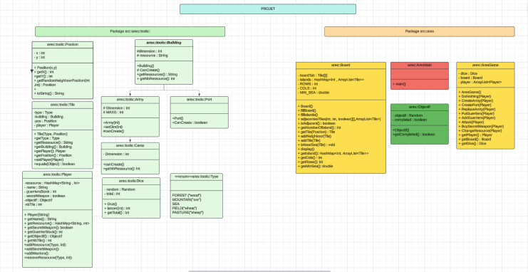

## Livrable 2

### Aperçu du projet
L’objectif de ce livrable est d’améliorer la génération du plateau en intégrant la gestion des bâtiments, tel que nous puissions les placer sur le tableau. Nous devons nous assurer que chaque joueur puisse construire les batiments sur les îles en respectant les contraintes imposés par le sujet.

#### Génération et Structure des Données

Nous avons structuré notre code en utilisant l'héritage. La classe mère est Building, et trois classes en héritent : Army, Ferme et Port. Ensuite, d'autres classes spécialisées héritent de ces dernières : Camp hérite de Army, Exploitation hérite de Ferme, et PortAres hérite de Port.

Voici la structure actuel du projet :

```sh
├── src
│   ├── Livrable2Main.java
│   ├── ares
│   │   ├── AresGame.java
│   │   ├── AresMain.java
│   │   └── Objectif.java
│   ├── demeter
│   │   └── DemeterMain.java
│   └── tools
│       ├── Army.java
│       ├── Board.java
│       ├── Building.java
│       ├── Camp.java
│       ├── Dice.java
│       ├── Exploitation.java
│       ├── Farm.java
│       ├── Input.java
│       ├── Player.java
│       ├── Port.java
│       ├── Position.java
│       ├── Tile.java
│       └── Type.java
└── test
    └── tools
        ├── ArmyTest.java
        ├── BoardTest.java
        ├── CampTest.java
        ├── ExploitationTest.java
        ├── FarmTest.java
        ├── PositionTest.java
        ├── TileTest.java
        └── TypeTest.java

```

Suite à une réorganisation, nous avons adopté une nouvelle structure de projet qui nous permettra par la suite de généraliser la base du code pour le jeu Demeter.

#### Organisation du code :

Pour structurer notre projet, nous avons ajouté/modifié les classes suivantes :

 - Building.java : représente un bâtiment avec sa dimension et le nombre de ressource qu’elle renvoie
 - Board.java : mise à jour de la génération du plateau pour inclure les bâtiments.

Nous avons aussi ajouter des classes qui hérite de Building comme Farm , Exploitation , Camp , Army , Port
Ces classes ont une chacune une déscription dans la docs
 - Les classes AresMain et Livrable2Main permettant d'avoir un bref aperçu de l'état de l'éxecution d'une partie.

#### Méthodes principalement implémentées

Voici pour le display , la correspondance des lettres pour chaque batiment grâce à la méthode :

```java
  /**
   * renvoie une chaine correspondant au batiment
   * @param tile la tuile sur laquel le batiment est posé
   * @return la chaine correspondant au batiment
   */
  public String getBuildingString(Tile tile){
      String res;
      if(tile.getBuilding() instanceof Camp){
          res = "C";
      }
      else if(tile.getBuilding() instanceof Army){
          res = "A";
      }
      else if(tile.getBuilding() instanceof Exploitation){
          res = "E";
      }
      else if(tile.getBuilding() instanceof Farm){
          res = "F";
      }
      else{
          res = "P";
      }
      return res;
  }
```

Chaque batiment hérite de la classe Building donc l'obligation d'implémenter des méthodes comme :

```java
  /**
  * Methode renvoyant le nombre de ressource renvoyé par une tuile ressources
  @return le nombre de ressource
  **/
  abstract public int getRessources();

  /**
   * Methode qui représente un batiment avec sont cout
   * @return une chaine représentant le batiment
   */
  abstract public String toString();

  /**
   * Methode abstrait permettant d'obtenir le coût en ressources de la création d'un batiment sous forme d'une Map associant chaque ressoource à son coût (son nombre)
   * @return Une map qui contient les ressources et leurs coût pour chaque batiment
   */
  abstract public HashMap<String,Integer> getCostRessources();
```

Un bâtiment, en tant qu’entité conceptuelle, ne peut pas être implémenté directement. C’est pourquoi nous avons choisi d’en faire une classe abstraite, servant de modèle pour les différentes catégories de bâtiments.

Comme expliqué dans le sujet , le terme dimension est générique, il peut désigner une taille, comme une capacité ou n’importe quoi d’autre , c'est donc pour cela que nous avons opté pour le définir en tant qu'attribut de la classe Building qui sera utilisé , en fonction du contexte  , par les autres classes.

```java
protected int dimension;
```

Pour la modélisation d’un port et son placement, il était nécessaire qu’il soit adjacent à au moins une tuile mer. Nous avons donc implémenté la méthode suivante afin de vérifier si le placement d’un port est valide (Classe Board) :

```java
  /**
  * methode permettant de savoir si la tuile est voisine à une tuile de type mer
  * @return renvoie true si la tuile est voisine à une tuile de type mer, false sinon
  */
  public Boolean isNearSea(Tile tile){
      boolean res = false; 
      int y = tile.getPosition().getY();
      int x = tile.getPosition().getX();
      
      for (int i=-1; i<=1; i++){
          Position pos = new Position(x+i, y, false);
          if(0<=x+i && x+i <= this.rows && this.getTile(pos).getType() == Type.SEA){
              res = true;
          }
      }

      for (int i=-1; i<=1; i++){
          Position pos = new Position(x, y+i, false);
          if(0<=y+i && y+i<= this.cols && this.getTile(pos).getType() == Type.SEA){
              res = true;
          }
      }
      return res;
  }
```


#### Affichage et interaction

*simulation de génération de plateau*

```sh
------- Plateau de jeu -------
Entrez un nombre de lignes: 
10
Entrez un nombre de colones: 
10
         0      1      2      3      4      5      6      7      8      9      
      +------+------+------+------+------+------+------+------+------+------+
 0    | ---- | ---- | ---- | ---- | f... | ---- | ---- | ---- | ---- | ---- |
      +------+------+------+------+------+------+------+------+------+------+
 1    | F... | M... | ---- | ---- | F... | ---- | f... | ---- | ---- | ---- |
      +------+------+------+------+------+------+------+------+------+------+
 2    | ---- | ---- | ---- | ---- | ---- | ---- | F... | ---- | ---- | ---- |
      +------+------+------+------+------+------+------+------+------+------+
 3    | ---- | ---- | ---- | M... | f... | ---- | ---- | ---- | ---- | ---- |
      +------+------+------+------+------+------+------+------+------+------+
 4    | ---- | ---- | ---- | ---- | ---- | ---- | ---- | ---- | ---- | ---- |
      +------+------+------+------+------+------+------+------+------+------+
 5    | ---- | M... | ---- | F... | ---- | ---- | ---- | ---- | ---- | ---- |
      +------+------+------+------+------+------+------+------+------+------+
 6    | ---- | F... | ---- | F... | ---- | ---- | ---- | ---- | ---- | ---- |
      +------+------+------+------+------+------+------+------+------+------+
 7    | ---- | ---- | ---- | ---- | ---- | ---- | ---- | F... | ---- | ---- |
      +------+------+------+------+------+------+------+------+------+------+
 8    | ---- | ---- | ---- | F... | F... | ---- | ---- | P... | ---- | ---- |
      +------+------+------+------+------+------+------+------+------+------+
 9    | F... | P... | ---- | P... | F... | ---- | ---- | ---- | ---- | ---- |
      +------+------+------+------+------+------+------+------+------+------+

-------Tour 1-------
         0      1      2      3      4      5      6      7      8      9      
      +------+------+------+------+------+------+------+------+------+------+
 0    | ---- | ---- | ---- | ---- | f.TE | ---- | ---- | ---- | ---- | ---- |
      +------+------+------+------+------+------+------+------+------+------+
 1    | F.LA | M.LF | ---- | ---- | F.TC | ---- | f... | ---- | ---- | ---- |
      +------+------+------+------+------+------+------+------+------+------+
 2    | ---- | ---- | ---- | ---- | ---- | ---- | F... | ---- | ---- | ---- |
      +------+------+------+------+------+------+------+------+------+------+
 3    | ---- | ---- | ---- | M... | f... | ---- | ---- | ---- | ---- | ---- |
      +------+------+------+------+------+------+------+------+------+------+
 4    | ---- | ---- | ---- | ---- | ---- | ---- | ---- | ---- | ---- | ---- |
      +------+------+------+------+------+------+------+------+------+------+
 5    | ---- | M... | ---- | F... | ---- | ---- | ---- | ---- | ---- | ---- |
      +------+------+------+------+------+------+------+------+------+------+
 6    | ---- | F... | ---- | F... | ---- | ---- | ---- | ---- | ---- | ---- |
      +------+------+------+------+------+------+------+------+------+------+
 7    | ---- | ---- | ---- | ---- | ---- | ---- | ---- | F... | ---- | ---- |
      +------+------+------+------+------+------+------+------+------+------+
 8    | ---- | ---- | ---- | F... | F... | ---- | ---- | P... | ---- | ---- |
      +------+------+------+------+------+------+------+------+------+------+
 9    | F... | P... | ---- | P... | F... | ---- | ---- | ---- | ---- | ---- |
      +------+------+------+------+------+------+------+------+------+------+
Timo - Ressources: {ore=0, wheat=0, wood=2, sheep=2}
Leon - Ressources: {ore=1, wheat=0, wood=1, sheep=0}


Coût des batiments 

Armée: 1 bois, 1 mouton, 1 blé
Exploitation: 2 bois, 1 blé, 1 mouton
Camp: 2 bois, 3 minerais
Port: 1 bois, 2 moutons
Ferme: 1 bois, 1 minerai

------- Iles du jeu -------
Nombre d'île: 9
```

Voici par exemple un plateau de 10 par 10 à 1 tour de jeu , avec la modélisation de bâtiments(Classe src.Livrable2Main).
L'affichage à été mis à jour notamment avec des fonctions toString() pour chaque batiment qui permettant d'informer l'utilisateur textuellement.

### Difficultés rencontrées
1.  Ports
  - L’implémentation de la classe Port a posé certaines difficultés, car les ports des deux jeux avaient des utilités différentes. Après réflexion, nous avons décidé de ne créer qu’une seule classe Port, en intégrant leurs effets spécifiques dans les classes AresGame et DemeterGame.
2.  canCreate
  - Initialement, nous avions envisagé d’ajouter une méthode canCreate dans la classe Building, afin que toutes ses classes dérivées en héritent directement. Cependant, cette approche s’est révélée inadaptée, car la création d’un bâtiment dépend de l’existence préalable d’un objet Joueur. Finalement, nous avons décidé d’implémenter cette fonctionnalité au niveau du jeu, plutôt que dans Building.
3. Heritage de Building
  - Notre projet initial ne prévoyait qu’un seul jeu, mais l’ajout d’une seconde variante nous a obligés à unifier les fonctionnalités des deux versions sous une même structure.
  
### Difficultés restant à résoudre

Pour le livrable 2, nous travaillons sur l’implémentation de DemeterMain ainsi que sur la mécanique permettant à un joueur de placer un bâtiment. Ces éléments sont cruciaux pour garantir le bon fonctionnement du projet sur les jeux Ares et Demeter.

Nous devons également implémenter les méthodes canCreate(), qui permettront de vérifier si un joueur peut construire un bâtiment sur une île en respectant les contraintes du sujet :

1. Pour construire une armée ou un port sur une île non occupée, le joueur doit posséder au moins un port sur une île qu’il occupe déjà.
2. Pour occuper une nouvelle île, le joueur doit avoir au moins 2 bâtiments sur chaque île déjà occupée.

Ces méthodes seront intégrées dans les classes ares.aresGame et demeter.demeterGame.

### UML livrable 2

Voici une la structure de l'héritage concernant les batiments :

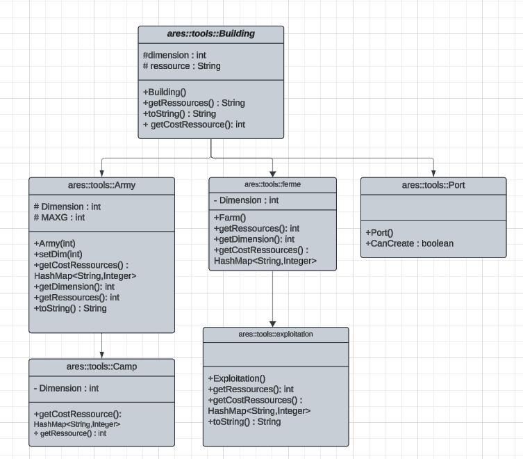

## Livrable 3

### Aperçu du projet

Le livrable 3 se concentre sur l'implémentation des mécaniques fondamentales du jeu, notamment :

- La gestion des ressources et des actions des joueurs (construction, attaque)
- Les règles spécifiques d'Ares et Demeter
- Le système de combat avec guerriers et armes secrètes
- La gestion des tours et du dé
- Les échanges via les ports
- Les conditions de victoire

Pour tester l'état du projet, des commandes make et deux fichiers exécutables sont mis à disposition :

Pour le jeu Ares :
```sh
java -jar aresLivrable3.jar
```

Pour le jeu Demeter :
```sh
java -jar demeterLivrable3.jar
```

### Affichage et interaction

Pour tester le livrable 3 et voir une simulation de notre modélisation des actions, vous pouvez exécuter l'une des commandes suivantes:
Pour compiler les classes du projet:  
```sh
make
```  
Pour le jeu Ares:
```sh
make runAres
```

Pour le jeu Demeter:
```sh
make runDemeter
```

*Pour lancer le jeu (et non une simulation), utilisez la commande :*
```sh
make ares 
```

```sh
make demeter 
```

Pour lancer les tests:  
```sh
make test-all
``` 

Pour génrer la documentation des packages tools, game et exception:  
```sh
make doc
```
Ensuite ouvrir lle fichier `docs/index.html`  

N'oubliez pas de compiler avec __make__ 


Ces commandes lanceront directement le jeu correspondant en ligne de commande.

```sh
java -classpath classes Livrable3Main demeter
------- Bienvenue dans Demeter -------
------- Plateau de jeu -------
Entrez un nombre de lignes: 
10
Entrez un nombre de colones: 
10
Légende du plateau :
---------------------
🌲  : Forêt
⛰️   : Montagne
🍀  : Paturages
🌻  : Champ
🌊  : Mer
------ Batiments ------
⛏️  : Exploitation
🚜 : Ferme
🛥️  : Port
---------------------
         0      1      2      3      4      5      6      7      8      9      
      +------+------+------+------+------+------+------+------+------+------+
 0    |⛰️ ... |🌊🌊  |🌊🌊  |🌊🌊  |🌊🌊  |🌻... |⛰️ ... |🍀... |🌊🌊  |🌊🌊  |
      +------+------+------+------+------+------+------+------+------+------+
 1    |🌻... |🌊🌊  |🌊🌊  |🌊🌊  |🌊🌊  |🌻... |🌊🌊  |🌊🌊  |🌊🌊  |🌊🌊  |
      +------+------+------+------+------+------+------+------+------+------+
 2    |⛰️ ... |🌊🌊  |🌻... |🌊🌊  |⛰️ ... |🌲... |🍀... |🌊🌊  |🌊🌊  |🌊🌊  |
      +------+------+------+------+------+------+------+------+------+------+
 3    |⛰️ ... |⛰️ ... |⛰️ ... |🌊🌊  |🍀... |🌻... |🍀... |🌊🌊  |🌊🌊  |🌊🌊  |
      +------+------+------+------+------+------+------+------+------+------+
 4    |🌊🌊  |🌻... |🌊🌊  |🌊🌊  |🌻... |🌊🌊  |🌊🌊  |🌊🌊  |🌊🌊  |🌊🌊  |
      +------+------+------+------+------+------+------+------+------+------+
 5    |🌊🌊  |🌊🌊  |🌊🌊  |🌊🌊  |🌲... |🌊🌊  |🌲... |🌊🌊  |🌊🌊  |🌊🌊  |
      +------+------+------+------+------+------+------+------+------+------+
 6    |⛰️ ... |⛰️ ... |🌊🌊  |🌊🌊  |🌊🌊  |🌊🌊  |🌻... |🌊🌊  |🍀... |🌊🌊  |
      +------+------+------+------+------+------+------+------+------+------+
 7    |⛰️ ... |⛰️ ... |🌻... |🌻... |🌻... |🌲... |🌊🌊  |🌊🌊  |🍀... |🌊🌊  |
      +------+------+------+------+------+------+------+------+------+------+
 8    |🍀... |🌻... |🌊🌊  |🌊🌊  |🌊🌊  |🌊🌊  |🌊🌊  |🌊🌊  |🌊🌊  |🌊🌊  |
      +------+------+------+------+------+------+------+------+------+------+
 9    |🌊🌊  |🌊🌊  |🌊🌊  |🌊🌊  |🌊🌊  |🌊🌊  |🌊🌊  |🌊🌊  |🌊🌊  |🌊🌊  |
      +------+------+------+------+------+------+------+------+------+------+
******* Action Timo *******
Le joueur Timo a créé une ferme à la position x:0 y:0
Le joueur Timo a remplacé une ferme par une exploitation à la position x:0 y:0
Le joueur Timo a un voleur: true
Vous devez posséder un port sur une autre île avant de construire ici.
Le joueur Timo a échangé des ressources avec un port
Vous n'avez pas de voleur.
Le joueur Timo a joué le voleur et volé des ressources
         0      1      2      3      4      5      6      7      8      9      
      +------+------+------+------+------+------+------+------+------+------+
 0    |⛰️ .T⛏️ |🌊🌊  |🌊🌊  |🌊🌊  |🌊🌊  |🌻.L. |⛰️ .L. |🍀.L. |🌊🌊  |🌊🌊  |
      +------+------+------+------+------+------+------+------+------+------+
 1    |🌻.T. |🌊🌊  |🌊🌊  |🌊🌊  |🌊🌊  |🌻.L. |🌊🌊  |🌊🌊  |🌊🌊  |🌊🌊  |
      +------+------+------+------+------+------+------+------+------+------+
 2    |⛰️ .T. |🌊🌊  |🌻.T. |🌊🌊  |⛰️ .L. |🌲.L. |🍀.L. |🌊🌊  |🌊🌊  |🌊🌊  |
      +------+------+------+------+------+------+------+------+------+------+
 3    |⛰️ .T. |⛰️ .T. |⛰️ .T. |🌊🌊  |🍀.L. |🌻.L. |🍀.L. |🌊🌊  |🌊🌊  |🌊🌊  |
      +------+------+------+------+------+------+------+------+------+------+
 4    |🌊🌊  |🌻.T. |🌊🌊  |🌊🌊  |🌻.L. |🌊🌊  |🌊🌊  |🌊🌊  |🌊🌊  |🌊🌊  |
      +------+------+------+------+------+------+------+------+------+------+
 5    |🌊🌊  |🌊🌊  |🌊🌊  |🌊🌊  |🌲.L. |🌊🌊  |🌲... |🌊🌊  |🌊🌊  |🌊🌊  |
      +------+------+------+------+------+------+------+------+------+------+
 6    |⛰️ ... |⛰️ ... |🌊🌊  |🌊🌊  |🌊🌊  |🌊🌊  |🌻... |🌊🌊  |🍀... |🌊🌊  |
      +------+------+------+------+------+------+------+------+------+------+
 7    |⛰️ ... |⛰️ ... |🌻... |🌻... |🌻... |🌲... |🌊🌊  |🌊🌊  |🍀... |🌊🌊  |
      +------+------+------+------+------+------+------+------+------+------+
 8    |🍀... |🌻... |🌊🌊  |🌊🌊  |🌊🌊  |🌊🌊  |🌊🌊  |🌊🌊  |🌊🌊  |🌊🌊  |
      +------+------+------+------+------+------+------+------+------+------+
 9    |🌊🌊  |🌊🌊  |🌊🌊  |🌊🌊  |🌊🌊  |🌊🌊  |🌊🌊  |🌊🌊  |🌊🌊  |🌊🌊  |
      +------+------+------+------+------+------+------+------+------+------+
******* Action Léon *******
Le joueur Léon a créé une ferme à la position x:0 y:5
Le joueur Léon a remplacé une ferme par une exploitation à la position x:0 y:5
Le joueur Léon a un voleur: true
Vous devez posséder un port sur une autre île avant de construire ici.
Le joueur Léon a échangé des ressources avec un port
Vous n'avez pas de voleur.
Le joueur Léon a joué le voleur et volé des ressources
         0      1      2      3      4      5      6      7      8      9      
      +------+------+------+------+------+------+------+------+------+------+
 0    |⛰️ .T⛏️ |🌊🌊  |🌊🌊  |🌊🌊  |🌊🌊  |🌻.L⛏️ |⛰️ .L. |🍀.L. |🌊🌊  |🌊🌊  |
      +------+------+------+------+------+------+------+------+------+------+
 1    |🌻.T. |🌊🌊  |🌊🌊  |🌊🌊  |🌊🌊  |🌻.L. |🌊🌊  |🌊🌊  |🌊🌊  |🌊🌊  |
      +------+------+------+------+------+------+------+------+------+------+
 2    |⛰️ .T. |🌊🌊  |🌻.T. |🌊🌊  |⛰️ .L. |🌲.L. |🍀.L. |🌊🌊  |🌊🌊  |🌊🌊  |
      +------+------+------+------+------+------+------+------+------+------+
 3    |⛰️ .T. |⛰️ .T. |⛰️ .T. |🌊🌊  |🍀.L. |🌻.L. |🍀.L. |🌊🌊  |🌊🌊  |🌊🌊  |
      +------+------+------+------+------+------+------+------+------+------+
 4    |🌊🌊  |🌻.T. |🌊🌊  |🌊🌊  |🌻.L. |🌊🌊  |🌊🌊  |🌊🌊  |🌊🌊  |🌊🌊  |
      +------+------+------+------+------+------+------+------+------+------+
 5    |🌊🌊  |🌊🌊  |🌊🌊  |🌊🌊  |🌲.L. |🌊🌊  |🌲... |🌊🌊  |🌊🌊  |🌊🌊  |
      +------+------+------+------+------+------+------+------+------+------+
 6    |⛰️ ... |⛰️ ... |🌊🌊  |🌊🌊  |🌊🌊  |🌊🌊  |🌻... |🌊🌊  |🍀... |🌊🌊  |
      +------+------+------+------+------+------+------+------+------+------+
 7    |⛰️ ... |⛰️ ... |🌻... |🌻... |🌻... |🌲... |🌊🌊  |🌊🌊  |🍀... |🌊🌊  |
      +------+------+------+------+------+------+------+------+------+------+
 8    |🍀... |🌻... |🌊🌊  |🌊🌊  |🌊🌊  |🌊🌊  |🌊🌊  |🌊🌊  |🌊🌊  |🌊🌊  |
      +------+------+------+------+------+------+------+------+------+------+
 9    |🌊🌊  |🌊🌊  |🌊🌊  |🌊🌊  |🌊🌊  |🌊🌊  |🌊🌊  |🌊🌊  |🌊🌊  |🌊🌊  |
      +------+------+------+------+------+------+------+------+------+------+
Ressources de Timo :
💎 : 8
🌾 : 8
🪵 : 16
🐑 : 9

Ressources de Léon :
💎 : 8
🌾 : 8
🪵 : 22
🐑 : 9


------- Iles du jeu -------
Nombre d'île: 5

```


### Génération et Structure des Données

Changements par rapport au Livrable 2
Ajout de nouvelles classes et packages :

Package game : Ce package contient les classes AresGame.java, DemeterGame.java, et Game.java qui gèrent les règles et la logique des jeux Ares et Demeter.
Package exception : Ce package contient des classes d'exception spécifiques pour gérer les erreurs dans le jeu, telles que AlreadyHaveSecretWeaponException.java, NoMoreThievesException.java, NotEnoughRessourcesException.java, TileIsNotNearSeaException.java, WrongBuildingException.java, WrongRessourceException.java, et WrongTileException.java.

Voici la structure actuel du projet : 

```sh
.
├── ares
│   ├── AresMain.java
│   └── Objectif.java
├── demeter
│   ├── DemeterMain.java
│   └── Objectif.java
├── game
│   ├── AresGame.java
│   ├── DemeterGame.java
│   └── Game.java
├── Livrable2Main.java
├── Livrable3Main.java
└── tools
    ├── Army.java
    ├── Board.java
    ├── Building.java
    ├── Camp.java
    ├── Dice.java
    ├── exception
    │   ├── AlreadyBuildingPlayerException.java
    │   ├── AlreadyHaveSecretWeaponException.java
    │   ├── ArmyDimensionException.java
    │   ├── NoMoreThievesException.java
    │   ├── NotEnoughRessourcesException.java
    │   ├── NoTileNearSeaException.java
    │   ├── TileIsNotNearSeaException.java
    │   ├── WrongBuildingException.java
    │   ├── WrongPositionException.java
    │   ├── WrongRessourceException.java
    │   └── WrongTileException.java
    ├── Exploitation.java
    ├── Farm.java
    ├── Input.java
    ├── Player.java
    ├── Port.java
    ├── Position.java
    ├── Tile.java
    └── Type.java

```

### Méthodes principalement implémentées

Au cours du développement, nous avons remarqué quelques similitudes entre les actions de Demeter et d'Ares. Nous avons donc pris la décision de regrouper les méthodes communes dans un package `game` avec une classe abstraite `Game` qui contient les méthodes principales ci-dessous :

```java
    /**
     * Permet au joueur de placer un port à condition que celui ci soit adjacent à la mer.
     * @param player Le joueur
     * @param pos La position du port
     */
    public void createPort(Player player , Position pos){
        Map<String, Integer> ressources = player.getRessource();
        try{
            if(!this.board.validPosition(pos)){
                throw new WrongPositionException("Position invalide");
            }
            if(ressources.get("wood") >= 1 && ressources.get("sheep") >= 2){
                if (this.board.isNearSea(this.board.getTile(pos))){
                    if (this.playerOnIsland(player,pos)) {
                            this.board.getTile(pos).setBuilding(new Port());
                            this.board.getTile(pos).setPlayer(player);
                            player.addRessource(Type.FOREST, -1);
                            player.addRessource(Type.FIELD, -2);
                            this.next = true;
   
                    } 
                    else{
                        throw new WrongTileException("Vous ne possèdez pas de tuile sur l'ile");
                    }
                }
                else{
                    throw new TileIsNotNearSeaException("La tuile n'est pas adjacentes à une case de type mer");
                }
            }
            else{
                throw new NotEnoughRessourcesException("Vous n'avez pas assez de ressources");
            }
        }
        catch(WrongTileException | NotEnoughRessourcesException | TileIsNotNearSeaException | WrongPositionException e){
            System.out.println(e.getMessage());
            this.createPortUsage();
        }
    }
```
```java
/**
     * Permet à un joueur d'échanger 3 ressources identiques de son choix contre une autre.
     * @param player
     * @param ressource
     * @param giveRessource
     */
    public void changeResource(Player player, String getRessource, String giveRessource){
        try{
            int nbRessources = player.getRessource().get(giveRessource);
            if(nbRessources>=3){
                player.addRessource(Type.getType(getRessource), 1);
                player.addRessource(Type.getType(giveRessource), -3);
            }
            throw new NotEnoughRessourcesException("Nombre de ressource insuffisante");
        }
        catch(WrongRessourceException | NotEnoughRessourcesException e){
            System.out.println(e.getMessage());
            this.changeResourceUsage();
        }
    }

     /**
     * permet d'acheter une arme secrète
     * @param player
     */
    public abstract void buySecretWeapon(Player player);
```

Ces méthodes sont cohérentes dans les deux jeux.

Ensuite, nous avons défini les classes AresGame et DemeterGame comme des classes héritant de la classe abstraite Game. Chacune de ces classes implémente les règles spécifiques du jeu auquel elle correspond.

Voici quelques exemples 

Pour Demeter :

```java
    /**
     * Action -> créer une ferme
     * @param player Le joueur
     * @param pos Position de la ferme
     */
    public void createFarm(Player player,Position pos ){  
        try{
            Map<String, Integer> ressources = player.getRessource();
            if (ressources.get("wood") >= 1 && ressources.get("ore") >= 1){  
                this.board.getTile(pos).setBuilding(new Farm());
                this.board.getTile(pos).setPlayer(player);
                player.addRessource(Type.FOREST, -1);
                player.addRessource(Type.MOUNTAIN, -1);
                this.next = true;
            }
            else{
                throw new NotEnoughRessourcesException("Vous n'avez pas assez de ressouces pour créer une ferme");
            }
        }
        catch(NotEnoughRessourcesException e){
            System.out.println(e.getMessage());
        }
    }     

    /**
     * Action -> remplacer une ferme par une exploitation
     * @param player Le joueur
     * @param pos La position de la ferme à remplacer
     */
    public void replaceFarm(Player player,Position pos){
        try{
            if((player.getRessource().get("wood") >= 2 && player.getRessource().get("wheat") >= 1 && player.getRessource().get("sheep") >= 1)){
                if(playerOnIsland(player, pos)){
                    this.board.getTile(pos).setBuilding(new Exploitation());
                    player.addRessource(Type.FOREST, -2);
                    player.addRessource(Type.PASTURE, -1);
                    player.addRessource(Type.FIELD, -1);
                    this.next = true;
                }
                else{
                    throw new WrongTileException("Vous ne possèdez pas la tuile");
                }
            }
            else{
                throw new NotEnoughRessourcesException("Ressources insuffisantes");
            }
        }
        catch(WrongTileException | NotEnoughRessourcesException e){
            System.out.println(e.getMessage());
        }
    }
```

et pour Ares :

```java
    /**
     * Gère le combat entre deux joueurs sur des positions spécifiques du plateau.
     * 
     * @param player1 Premier joueur participant au combat
     * @param player2 Deuxième joueur participant au combat
     * @param positionP1 Position des unités du premier joueur sur le plateau
     * @param positionP2 Position des unités du deuxième joueur sur le plateau
     * @param swP1 Booléen indiquant si le joueur 1 utilise une arme secrète
     * @param swP2 Booléen indiquant si le joueur 2 utilise une arme secrète
     * 
     * @throws WrongTileException Si les positions de combat ne sont pas valides
     * @throws NotEnoughRessourcesException Si un joueur tente d'utiliser une arme secrète sans en posséder
     * 
     * Le combat se déroule comme suit:
     * - Vérifie la validité des positions et la possession d'armes secrètes
     * - Lance les dés pour chaque armée en fonction de leur taille et de l'utilisation d'armes secrètes
     * - Applique les pertes en fonction du résultat:
     *   - Le perdant perd une unité
     *   - En cas d'égalité, les deux joueurs perdent une unité
     *   - Si une armée atteint 0 unité, elle est retirée du plateau
     */
    public void attack(Player player1, Player player2, Position positionP1, Position positionP2, boolean swP1, boolean swP2){
        try{
            if(!this.isValidTile(positionP1, positionP2)){
                throw new WrongTileException("Les positions ne sont pas valides");
            }
            if(swP1 && !player1.haveSecretWeapon()){
                throw new NotEnoughRessourcesException("player1 vous ne possedez pas d'arme secrète");
            }
            if(swP2 && !player2.haveSecretWeapon()){
                throw new NotEnoughRessourcesException("player2 vous ne possedez pas d'arme secrète");
            }
            int nbGuerriersP1 = this.board.getTile(positionP1).getBuilding().getDimension();
            int nbGuerriersP2 = this.board.getTile(positionP2).getBuilding().getDimension(); 
            int player1NbDice = this.dice.nbLancer(nbGuerriersP1, swP1);
            int player2NbDice = this.dice.nbLancer(nbGuerriersP2, swP2);
            int nbPointP1 = this.dice.lancer(player1NbDice);
            int nbPointP2 = this.dice.lancer(player2NbDice);

            if(nbPointP1 < nbPointP2){
                if(nbGuerriersP1==1){
                    this.board.getTile(positionP1).removeBuilding();
                    this.board.getTile(positionP1).removePlayer();

                }
                else{
                    this.board.getTile(positionP1).getBuilding().setDim(nbGuerriersP1-1); 
                }
            }
            if(nbPointP1 > nbPointP2){
                if(nbGuerriersP2==1){
                    this.board.getTile(positionP2).removeBuilding();
                    this.board.getTile(positionP2).removePlayer();

                }
                else{
                    this.board.getTile(positionP2).getBuilding().setDim(nbGuerriersP2-1); 
                }
            }
            if(nbPointP1 == nbPointP2){
                if(nbGuerriersP1==1){
                    this.board.getTile(positionP1).removeBuilding();
                    this.board.getTile(positionP1).removePlayer();

                }
                else{
                    this.board.getTile(positionP1).getBuilding().setDim(nbGuerriersP1-1); 
                }
                if(nbGuerriersP2==1){
                    this.board.getTile(positionP2).removeBuilding();
                    this.board.getTile(positionP2).removePlayer();
                }
                else{
                    this.board.getTile(positionP2).getBuilding().setDim(nbGuerriersP2-1); 
                }
            }
            this.next = true;
            
        }
        catch(WrongTileException | WrongPositionException | NotEnoughRessourcesException e){
            System.out.println(e.getMessage());
            this.attackUsage();
        }
            
    }

    /**
     * methode permet de créer une armée sur une position donnée et une certaine dimension
     * @param player le joueur voulant créer une armée
     * @param pos la position sur laquel nous voulons créer notre armée 
     * @param dimension la dimension de notre armée
     */
    public void createArmy(Player player,Position pos , int dimension){
        try{
            if(dimension > 5){
                throw new ArmyDimensionException("Armée saturée");
            }
            if(!this.board.validPosition(pos)){
                throw new WrongPositionException("Position invalide");
            }
            if(this.board.getTile(pos).getType() == Type.SEA){
                throw new WrongPositionException("Position non valide");
            }
            if(this.board.getTile(pos).getPlayer() != null){
                throw new AlreadyBuildingPlayerException("Un autre joueur possède cette tuile");
            }
            if(!this.playerOnIsland(player, pos) && !player.getHasPort()){
                throw new WrongTileException("Vous ne possèdez aucune tuile sur cette ile");
            }
            Map<String, Integer> ressources = player.getRessource();
            if (ressources.get("wood") >= 1 && ressources.get("wheat") >= 1 && ressources.get("sheep") >= 1){  
                this.board.getTile(pos).setBuilding(new Army(dimension));
                this.board.getTile(pos).setPlayer(player);
                player.addRessource(Type.FOREST, -1);
                player.addRessource(Type.PASTURE, -1);
                player.addRessource(Type.FIELD, -1);
                this.next = true;
            }
            else{
                throw new NotEnoughRessourcesException("Vous n'avez pas assez de ressouces pour créer une armée");
            }
        }
        catch(NotEnoughRessourcesException | WrongPositionException | ArmyDimensionException | AlreadyBuildingPlayerException | WrongTileException e){
            System.out.println(e.getMessage());
            this.createArmyUsage();
        }
    } 
```

### Difficultés rencontrées

1. Interface utilisateur
     - Complexité pour traiter les entrées utilisateur et afficher les informations de jeu de manière claire.
     - Difficulté à trouver un bon équilibre entre fonctionnalités et simplicité d'utilisation.

2. Mécanique de jeu
     - Gestion du système de combat (Méthode attack dans Ares) et des ressources entre joueurs.
     - Implémentation des règles spécifiques pour chaque type de bâtiment.

3. Structure du code 
     - Maintenir une architecture cohérente entre les deux jeux.
     - Gérer efficacement l'héritage des classes et les exceptions.

4. Tests
     - Correction des bugs découverts lors des tests.

### UML Livrable 3

Voici la structure des packages concernant la modélisation des actions :

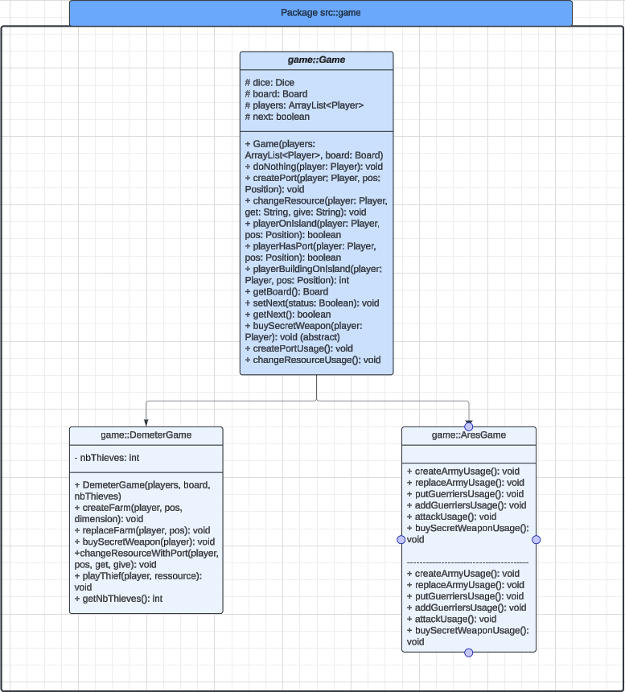

### Atteinte des objectifs et difficultés restant à résoudre (petit bilan)

Pour le livrable 3, nous avons réussi à modéliser toutes les actions principales du jeu. Le code permet maintenant de construire des bâtiments, gérer les combats avec guerriers et armes secrètes, et échanger des ressources. Les règles spécifiques d'Ares et Demeter ont été correctement implémentées.

Le code a été réorganisé en packages plus logiques, ce qui le rend plus facile à maintenir. Les classes utilisent l'héritage de manière efficace pour réutiliser le code commun. Nous avons ajouté des exceptions personnalisées pour mieux gérer les erreurs, et des tests pour vérifier que tout fonctionne correctement.

L'affichage du jeu utilise maintenant des emojis pour rendre le plateau plus lisible. Les messages d'erreur sont plus clairs et les actions sont bien visibles.

Il nous reste à gérer le système d'attribution des points et la récolte des ressources à implémenter au fil des tours du jeu.

Il reste encore du travail à faire. Nous devons finir l'automatisation des parties pour pouvoir tester toutes les règles. Il faut aussi revoir en détail les règles du jeu et compléter la documentation. Si nous avons le temps, nous aimerions ajouter une interface graphique simple et la possibilité de sauvegarder les parties.

Pour l'instant, nous nous concentrons sur la finalisation des fonctionnalités de base avant d'ajouter ces améliorations optionnelles. Les tests complets des scénarios de jeu restent une priorité.

## Livrable 4 - Finalisation du Projet

### Présentation générale
Le livrable 4 représente l'aboutissement de notre projet, marquant la transition d'un prototype fonctionnel vers un produit finalisé et jouable. Pour cette dernière phase, nous avons développé une interface en ligne de commande entièrement interactive, offrant une expérience utilisateur fluide et intuitive qui permet d'accéder à l'ensemble des fonctionnalités implémentées.

#### Améliorations majeures :

- Interface utilisateur
Nous avons entièrement repensé l'interface utilisateur en ligne de commande pour améliorer l'ergonomie et la lisibilité:

- Menu principal intuitif et hiérarchisé
- Système de feedback visuel avec codes couleur pour les actions et alertes
Affichage amélioré du plateau avec symboles distinctifs pour une meilleure identification des éléments
- Guide contextuel accompagnant l'utilisateur à chaque étape du jeu
Implémentation des objectifs de jeu

#### Correction et optimisation
Nous avons procédé à une révision complète du code source pour:

- Corriger les bugs identifiés lors des phases de test intensives
- Optimiser les algorithmes critiques pour améliorer les performances
- Renforcer la robustesse du système face aux entrées utilisateur imprévues
- Améliorer la documentation du code pour faciliter sa maintenance future


Voici la structure finale de notre Projet :

```sh
.
├── Makefile
├── README.md
├── UML version
│   ├── UML avant seance1.png
│   ├── UML livr2 bat.png
│   ├── UML livrable2.png
│   ├── UML v1.png
│   ├── UML v2.png
│   ├── UML v4 livrable1.webp
│   ├── UML v5.png
│   ├── Uml livrable 3.png
│   └── v3.png
├── junit-console.jar
├── lib
│   └── junit-platform-console-standalone-1.13.0-M1.jar
├── src
│   ├── game
│   │   ├── AresGame.java
│   │   ├── DemeterGame.java
│   │   └── Game.java
│   ├── liv
│   │   ├── FinalMain.java
│   │   ├── Livrable2Main.java
│   │   ├── Livrable3Main.java
│   │   └── Livrable4Main.java
│   └── tools
│       ├── Army.java
│       ├── Board.java
│       ├── Building.java
│       ├── Camp.java
│       ├── Dice.java
│       ├── Display.java
│       ├── Exploitation.java
│       ├── Farm.java
│       ├── Input.java
│       ├── Objectif.java
│       ├── Player.java
│       ├── Port.java
│       ├── Position.java
│       ├── TestingBoard.java
│       ├── Tile.java
│       ├── Type.java
│       └── exception
│           ├── AlreadyBuildingPlayerException.java
│           ├── AlreadyHaveSecretWeaponException.java
│           ├── ArmyDimensionException.java
│           ├── NoMoreThievesException.java
│           ├── NoTileNearSeaException.java
│           ├── NotEnoughRessourcesException.java
│           ├── TileIsNotNearSeaException.java
│           ├── WrongBuildingException.java
│           ├── WrongPositionException.java
│           ├── WrongRessourceException.java
│           └── WrongTileException.java
└── test
    ├── ares
    │   ├── ObjectifsTest.class
    │   └── ObjectifsTest.java
    ├── game
    │   ├── AresGameTest.class
    │   ├── AresGameTest.java
    │   ├── DemeterGameTest.class
    │   ├── DemeterGameTest.java
    │   ├── GameTest.class
    │   └── GameTest.java
    └── tools
        ├── ArmyTest.class
        ├── ArmyTest.java
        ├── BoardTest.class
        ├── BoardTest.java
        ├── BuildingTest.class
        ├── BuildingTest.java
        ├── CampTest.class
        ├── CampTest.java
        ├── DiceTest.class
        ├── DiceTest.java
        ├── ExploitationTest.class
        ├── ExploitationTest.java
        ├── FarmTest.class
        ├── FarmTest.java
        ├── PlayerTest.class
        ├── PlayerTest.java
        ├── PortTest.class
        ├── PortTest.java
        ├── PositionTest.class
        ├── PositionTest.java
        ├── TileTest.class
        ├── TileTest.java
        ├── TypeTest.class
        └── TypeTest.java

12 directories, 79 files
```

### Affichage et interaction

#### Le choix du jeu :

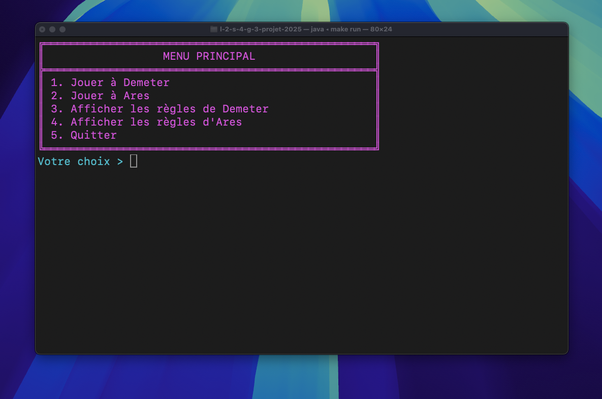
Nous avons décidé d'implémenter un menu interactif permettant aux joueurs de choisir le jeu auquel ils souhaitent jouer, offrant ainsi une expérience utilisateur plus intuitive et fluide.

Le Plateau d'Ares :

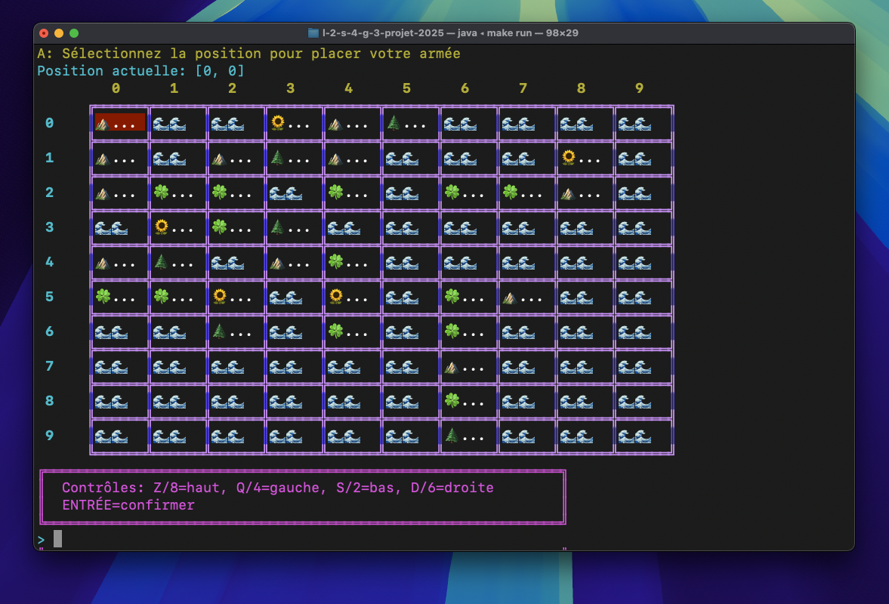

Le Plateau de Demeter :

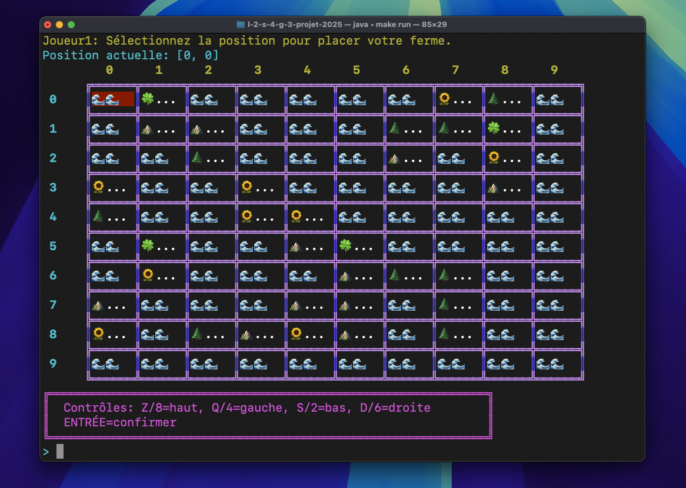

La Légende de Demeter :

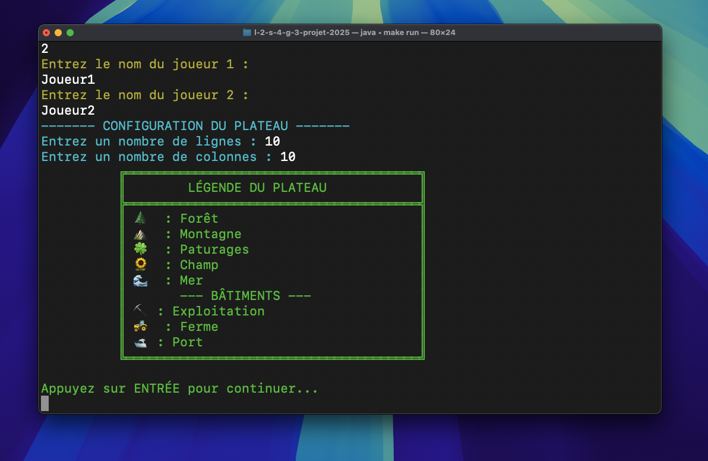

Les Actions de Demeter :


La roue de l'objectif :

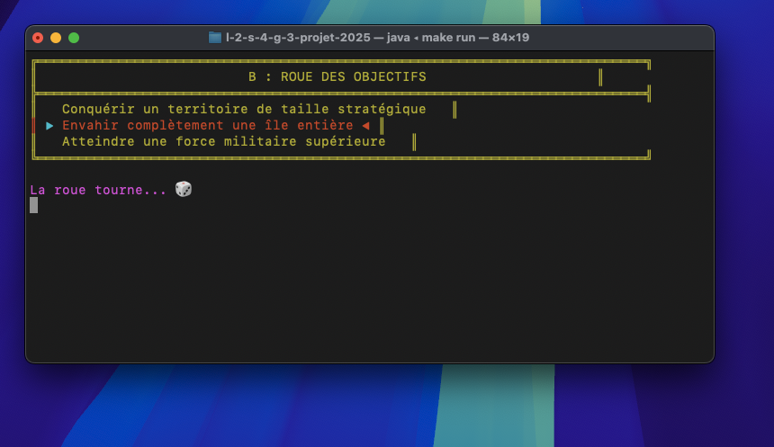

### Atteinte des objectifs

#### Interface Graphique

#### Affichage visuel du plateau
- Développement d'une interface graphique fonctionnelle permettant d'afficher le plateau de jeu
- Visualisation claire des tuiles et des bâtiments présents sur le plateau
- Représentation graphique des ressources et éléments du jeu

#### Interaction utilisateur améliorée
- Interface intuitive facilitant les actions des joueurs
- Navigation simplifiée entre les différentes phases du jeu
- Meilleure compréhension des actions réalisées pendant la partie

#### Système d'Objectifs Aléatoires
#### Génération d'objectifs pour Arès
- Implémentation conforme aux règles du jeu "Arès"
- Attribution automatique d'objectifs en début de partie
- Adaptation des objectifs à la taille du plateau de jeu

#### Diversification de l'expérience de jeu
- Variation des stratégies possibles entre les différentes parties
- Enrichissement de l'expérience de jeu grâce aux objectifs personnalisés
- Équilibrage des conditions de victoire entre les joueurs

#### Tests et Validation
#### Couverture complète des fonctionnalités
- Finalisation de toutes les méthodes de test
- Vérification du bon fonctionnement de la création du plateau
- Tests de la production de ressources et des actions des joueurs

#### Robustesse et fiabilité
- Validation des mécanismes de combat
- Tests de l'évolution des bâtiments
- Vérification des conditions de victoire
- Garantie de la stabilité de l'application

#### Optimisations et Corrections
#### Résolution des anomalies
- Identification et correction des bugs d'affichage
- Résolution des erreurs d'implémentation détectées
- Amélioration de la stabilité globale du projet

#### Amélioration de l'expérience utilisateur
- Révision complète de la cohérence du projet
- Alignement entre la logique métier (règles du jeu) et l'interface
- Fluidification de l'ensemble de l'expérience utilisateur

### Méthodes principalement implémentées

#### 1. Méthodes principales de gestion des jeux
- **`mainDemeter()`** : Gère l'intégralité du déroulement d'une partie du jeu Demeter, depuis l'initialisation jusqu'à la fin.
- **`mainAres()`** : Gère l'intégralité du déroulement d'une partie du jeu Ares, depuis l'initialisation jusqu'à la fin.

Ces méthodes suivent une structure similaire:
1. Initialisation du plateau et des joueurs
2. Distribution initiale des ressources
3. Tours de placement initiaux
4. Boucle principale du jeu avec gestion des actions
5. Vérification des conditions de victoire
6. Affichage des résultats

#### Display.java - Interface Utilisateur

#### 1. Animations et Affichage
- **`displayAresIntroAnimation()`** : Affiche une animation d'introduction épique pour Ares avec ASCII art et effets
- **`displayDemeterIntroAnimation()`** : Affiche une animation d'introduction pour Demeter avec effets de croissance
- **`displayBoardWithSelection(Board, int, int)`** : Affiche le plateau avec une position mise en évidence
- **`displayCombatAnimation()`** : Anime les combats entre joueurs avec effets visuels

#### 2. Interaction avec l'utilisateur
- **`initializePlayers()`** : Collecte les noms des joueurs et initialise leurs profils
- **`getPositionInputWithArrows(String, Board)`** : Permet de naviguer sur le plateau avec WASD/touches numériques
- **`getInputInt(String, int)`** : Récupère une entrée numérique avec validation minimale
- **`displayMainMenu()`** : Affiche le menu principal avec les options de jeu

#### 3. Interface de jeu
- **`displayActionsDemeter()`** / **`displayActionsAres()`** : Montrent les actions disponibles pour chaque jeu
- **`displayTileDetails(Board, Position)`** : Affiche les informations détaillées d'une tuile
- **`displayTurnHeader(Player, int)`** : Affiche l'en-tête au début de chaque tour
- **`displayObjectiveRoulette(String[], String)`** : Animation pour la sélection aléatoire d'objectifs

#### 4. Affichage des résultats
- **`displayScores(DemeterGame, ArrayList<Player>)`** : Affiche les scores actuels de tous les joueurs
- **`displayGameResultsDemeter()`** / **`displayGameResultsAres()`** : Montrent les résultats finaux de la partie
- **`displayObjectivesProgress(AresGame, ArrayList<Player>)`** : Montre la progression vers les objectifs

#### Exemple d'utilisation

Le jeu commence par l'appel à `displayMainMenu()` qui permet au joueur de choisir entre Ares et Demeter, puis appelle soit `mainAres()` soit `mainDemeter()`. Ces méthodes utilisent les fonctionnalités d'affichage et d'interaction de la classe Display pour offrir une expérience complète et interactive aux joueurs.

Par exemple, pendant un tour de jeu, le code appellera les méthodes comme `displayTurnHeader()`, `displayBoardWithSelection()` et `getPositionInputWithArrows()` pour permettre aux joueurs d'interagir avec le jeu de manière intuitive.

### Bilan de fin de Projet

Ce projet de développement des jeux Demeter et Ares nous a permis d'acquérir une expérience précieuse en matière de travail en équipe et de développement logiciel à moyenne échelle. Au cours de ces quatre livrables, nous avons dû faire face à différents défis qui ont été autant d'opportunités d'apprentissage.

La gestion d'un projet avec plusieurs composants interdépendants nous a enseigné l'importance d'une communication claire et régulière. Nous avons rapidement compris que la répartition efficace des tâches en fonction des compétences de chacun était essentielle pour progresser de manière cohérente. En particulier, la division du travail entre la logique métier (règles des jeux), l'interface utilisateur et les tests nous a permis d'avancer en parallèle sur différents fronts.

L'utilisation de Git comme outil de versionnage a été un élément crucial de notre collaboration, bien que nous ayons rencontré des difficultés avec les conflits de fusion, notamment lors de l'intégration des différentes fonctionnalités. Ces obstacles nous ont appris à mieux planifier nos commits et à organiser notre code de manière plus modulaire.

Au niveau technique, ce projet nous a permis de mettre en pratique les concepts orientés objet vus en cours, comme l'héritage et le polymorphisme, tout en développant notre intuition pour la conception de systèmes complexes. La création de deux jeux partageant une base commune mais avec des règles distinctes nous a obligés à penser en termes d'architecture flexible et adaptable.

Les séances hebdomadaires ont joué un rôle important dans notre progression, nous permettant de faire le point sur l'avancement, d'identifier les blocages et de réajuster notre planification. Cette expérience nous a montré qu'un projet informatique est rarement linéaire et qu'il faut savoir s'adapter aux imprévus.

En conclusion, au-delà des compétences techniques acquises, ce projet nous a permis de développer des aptitudes essentielles pour notre future vie professionnelle : capacité à travailler en équipe, à communiquer efficacement, à résoudre des problèmes complexes et à livrer un produit fonctionnel dans les délais impartis.

### UML du PROJET :

https://lucid.app/lucidchart/ca40334b-2b80-4636-bdbf-7932b1faace3/edit?viewport_loc=1031%2C-3480%2C6289%2C2885%2C0_0&invitationId=inv_0bc503bd-216e-45f6-9c95-878267161d32

Voici le lien qui permet de jeter un coup d'oeil à l'UML du Projet .

# Journal de bord

Le journal de bord doit être rempli à la fin de chaque séance encadrée, et avant de quitter la salle. 

Pour chaque semaine on y trouvera :
- ce qui a été réalisé, les difficultés rencontrées et comment elles ont été surmontées (on attend du contenu, pas uniquement une phrase du type "tous les objectifs ont été atteints")
- la liste des objectifs à réaliser d'ici à la prochaine séance encadrée

# Commandes
pack : les packages que vous souhaitez éxécuter
Makefile à disposition (voir livrable 3)

### Génération de la documentation
Pour générer la documentation Javadoc, exécutez :

```sh
.../l-2-s-4-g-3-projet-2025 $ make doc
```  
Puis:  
```sh
.../l-2-s-4-g-3-projet-2025 $ open docs/index.html
```

### Compilations
Pour compiler les sources du projet, exécutez :
```sh
.../l-2-s-4-g-3-projet-2025 $ make
```

Pour compiler tout les fichiers de test et les exécuter, utilisez la commande :
```sh
 .../l-2-s-4-g-3-projet-2025 $ make test-all
```

### Exécutions
Pour éxécuter le programme :
```sh
.../l-2-s-4-g-3-projet-2025 $ make run
```


#### Fichier exécutable
Pour créer le fichier exécutable:
```sh
.../l-2-s-4-g-3-projet-2025 $ make jar
```
Pour éxécuter le jar :
```sh
.../l-2-s-4-g-3-projet-2025 $ make run jar  
```

# Semaines :

## Semaine 1

### UML
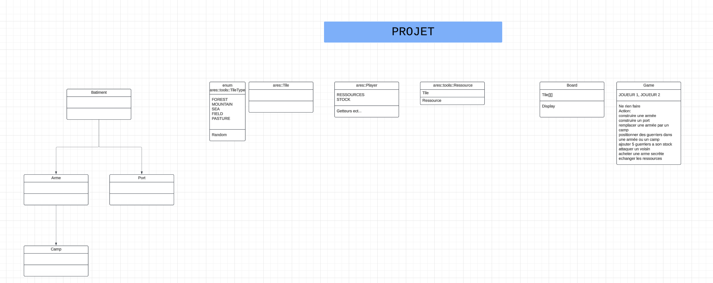

### Ce qui a été réalisé

Répartition des tâches, réflexion sur la structure du projet et debut de conception du diagramme UML.


### Difficultés rencontrées

Difficultés sur la comprehension du jeu.
objectif de relire et de s'assimiler le projet


### Objectifs pour la semaine

Poursuite de notre diagramme UML et début de l'implémentation du plateau de jeu

## Semaine 2


#### Ce qui a été réalisé avant la séance :
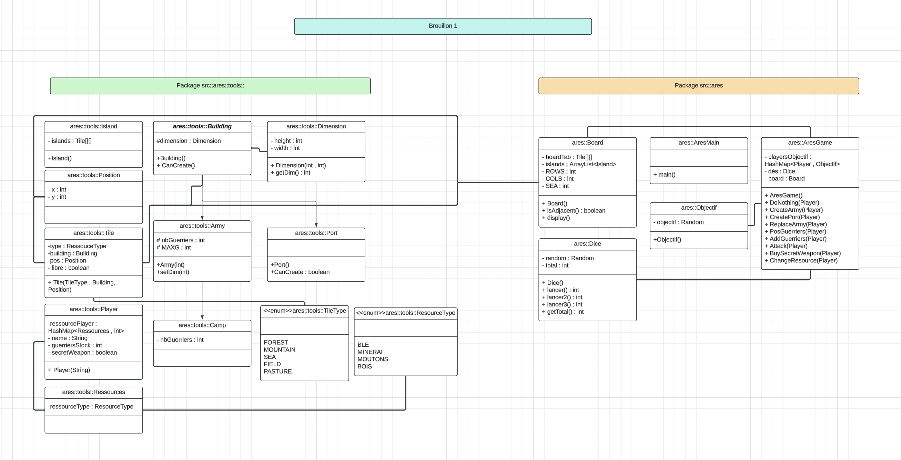

### Ce qui a été réalisé
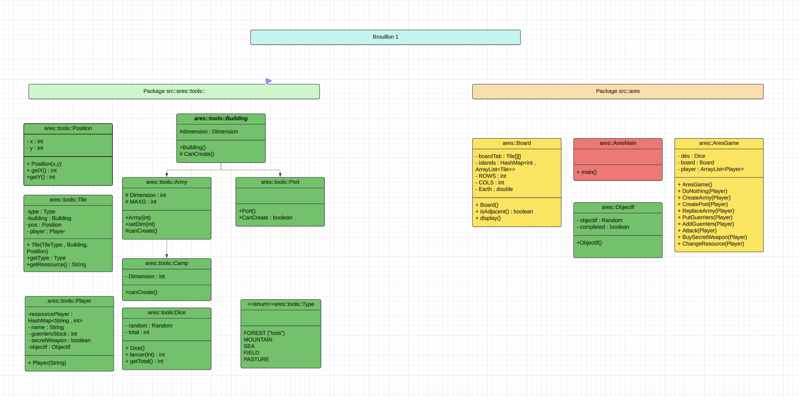

-Optimisation du diagramme UML.
-Organisation des packages en fonctions des classes.
### Difficultés rencontrées

Difficultés par rapport à la description des iles dans le sujet vis à vis des tuiles
et à l'assignation des tuiles à chaque joueurs

### Objectifs pour la semaine

Réflechir a savoir comment coder le plateau et commencer la mise en place de la structure du projet 
Répartition des tâches , définir l'ordres des classes à coder en fonction de la difficultés.

## Semaine 3

### Ce qui a été réalisé
Fin diagramme uml par zachari et billal.  
Bilal et Sofiane ont realisé la classe Position, ainsi que le constructeur dans la classe Board.
  
Zachari: Réalisation de la classe enum Type() et la methode random.  
Billal: Début de réalisation de la classe Building.

### UML  
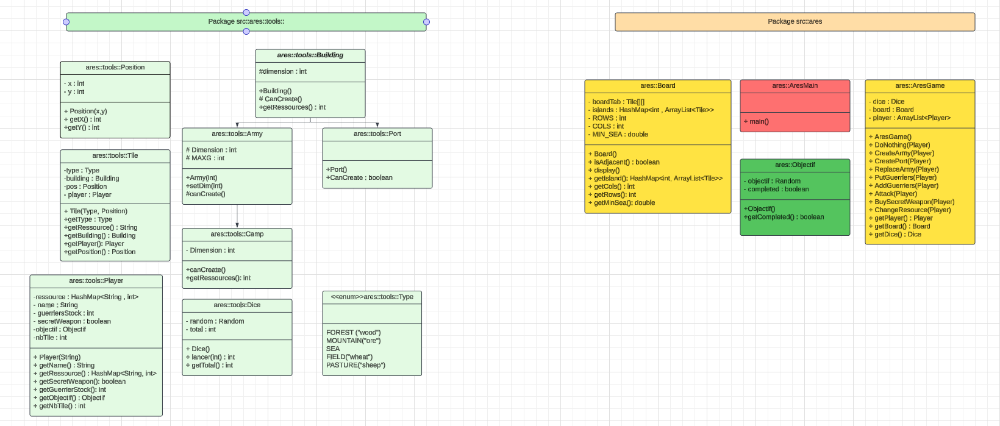  
* Billal AZDAD
* Zachari LEBLANC


### Difficultés rencontrées
Trouver l'ordre pour coder les classe car certaines classes disposent d'une autre. 

Bilal et Sofiane :
Lors de la création du constructeur pour le placement aléatoire, nous avons rencontré plusieurs difficultés. Initialement, nous avions envisagé de créer une interface randomInt afin de réutiliser la méthode aléatoire dans d'autres classes (comme pour Dice, par exemple). Cependant, nous avons finalement décidé d'abandonner cette idée pour privilégier la simplicité et la cohérence du code.

Les principales difficultés se sont ensuite manifestées dans la construction aléatoire du plateau :

Respecter le ratio de tuiles de mer, entre 2/3 et 3/3 du total mais si le plateau est rempli regénéré un autre utilisable.
Placer les tuiles de mer de manière aléatoire.

Enfin, nous avons également rencontré des difficultés dans le placement des tuiles de terre :
Vérifier que la tuile ciblée est vide avant de la placer.
Garantir qu'il y ait au moins deux tuiles de terre adjacentes tout en conservant un placement aléatoire.
### Objectifs pour la semaine  
Finir la création du plateau ( constructeur ) en terminant la construction des tuiles terre, regler la problématique d'obtenir un plateau uniquement composé de tuiles mer,  et avancer sur le package ```tools```.

## Semaine 4

### Ce qui a été réaliser avant la séance  
Zachari: Création d'une methode permettant de donner une case voisine en fonction de la position, création de la methode permettant d'afficher le plateau.  
         Implémentation du code pour créer le plateau de jeu (avec Bilal).
Sofiane : début d'implementation du premier port d'un joueur, necessité d'une methode dans la classe tuile permettant de savoir si une tuile est à coté d'une tuile mer 

Billal: Création de la classe Tile qui represente une tuile du tableau. Implementation de ses methodes et notamment de ses getters.
Implementation de la methode getNumberOfIsland permettant d'avoir le nombre d'île crée sur le plateau.
Modification de la classe AresMain pour permettre l'affichage de plateau ayant au moins 2 îles. 

Bilal: Implémentation des fonctions pour répertorier les différentes iles du jeu , pour les afficher et display du plateau.


### Ce qui a été réalisé
Sofiane et Bilal : 
- Amélioration de la classe Player en ajoutant des méthodes qui permettent de gérer les ressources , l'arme secrête et les guerriers
Sofiane : 
- Implémentation de la classe Dice qui permet de représenter un dé.

Bilal : 
- Commencement de l'implementation de AresGame
Zachari et Billal :  
- Réalisation des methodes de tests Position, Tile, Board + modificaton de la classe Tile est position.
Billal:

Zachari: Ajout de methodes pour les classes position et tile.   


### Difficultés rencontrées
Problèmes de conflits pour le git.  
### Objectifs pour la semaine

## Semaine 5

### Ce qui a été réalisé
Réflexion sur la modélisation des bâtiments et le lien entre les tuile pour le nombre de ressource.   
### Difficultés rencontrées
Définir le lien entre Tile, Batiment et Board.

### Objectifs pour la semaine
Finir de coder l'héritage de batiment. Ajout d'une fonctionnalité permettant de générer un plateau de taille choisie.
zachari: taille du plateau   
sofiane:implementation de la classe camp
billal: Afficher les batiments sur le plateau
bilal: 

## Semaine 6

### Ce qui a été réalisé
Réorganisation du projet en fonction du jeu. 
``` bash
.
├── ares
│   ├── AresGame.java
│   ├── AresMain.java
│   └── Objectif.java
├── demeter
│   └── DemeterMain.java
└── tools
    ├── Army.java
    ├── Board.java
    ├── Building.java
    ├── Camp.java
    ├── Dice.java
    ├── Input.java
    ├── Player.java
    ├── Port.java
    ├── Position.java
    ├── Tile.java
    └── Type.java
``` 
modification de l'uml, 

  
### Difficultés rencontrées

### Objectifs pour la semaine
implementer les ports pour demeter et ares, corriger les beug de la classe building

## Semaine 7

### Ce qui a été réalisé
Correction des erreurs liées au livrable 
### Difficultés rencontrées
Due à la methode fililsand, nous remarquons que nous obtenons une boucle infini commme resultat en fonction des iles qui etaient genere
### Objectifs pour la semaine
Corriger les erreurs due 

## Semaine 8
### Avant séance :
Ajout de fonction -> canAddNeighboor et getAllNeighboor

Changement du display :
```sh
Légende du plateau :
---------------------
🌲  : Forêt
⛰️   : Montagne
🍀  : Paturages
🌻  : Champ
🌊  : Mer
------ Batiments ------
🏕️  : Camp
🎖️  : Armée
⛏️  : Exploitation
🚜 : Ferme
🛥️  : Port
---------------------
         0      1      2      3      4      
      +------+------+------+------+------+
 0    |🍀... |🍀... |🍀... |🍀... |🌊🌊  |
      +------+------+------+------+------+
 1    |🌊🌊  |🌊🌊  |🌊🌊  |🌊🌊  |🌊🌊  |
      +------+------+------+------+------+
 2    |🌊🌊  |🌊🌊  |🌻... |🌊🌊  |🌊🌊  |
      +------+------+------+------+------+
 3    |⛰️ ... |🌻... |🌲... |🌊🌊  |🌊🌊  |
      +------+------+------+------+------+
 4    |🌊🌊  |🌊🌊  |🌊🌊  |🌊🌊  |🌊🌊  |
      +------+------+------+------+------+

-------Tour 1-------
         0      1      2      3      4      
      +------+------+------+------+------+
 0    |🍀.T🛥️ |🍀.T. |🍀.T. |🍀.T. |🌊🌊  |
      +------+------+------+------+------+
 1    |🌊🌊  |🌊🌊  |🌊🌊  |🌊🌊  |🌊🌊  |
      +------+------+------+------+------+
 2    |🌊🌊  |🌊🌊  |🌻.L🎖️ |🌊🌊  |🌊🌊  |
      +------+------+------+------+------+
 3    |⛰️ .L🏕️ |🌻.L⛏️ |🌲.L🚜|🌊🌊  |🌊🌊  |
      +------+------+------+------+------+
 4    |🌊🌊  |🌊🌊  |🌊🌊  |🌊🌊  |🌊🌊  |
      +------+------+------+------+------+

```

Ajout d'un Makefile -> make pour compiler
make run pour exécuter le livrable 2
### Ce qui a été réalisé

Correction bug -> Boucle infinie dans la génération du plateau (essai pour 5000*5000 réussi)

Correction de la pose des tuiles -> Pour avoir au minimum un voisin donc pour éviter d'avoir des iles avec une seule tuile
### Difficultés rencontrées
Difficulté pour trouver la boucle infinie et pour choisir les bonnes coordonnées.

### Objectifs pour la semaine
Commencer l'implémentation des règles du jeu et de pouvoir commencer une partie.

## Semaine 9

### Ce qui a été réalisé

- Ajout des méthodes pour gérer les actions des joueurs, telles que la création d'armées et de ports, la gestion des ressources, et l'attaque.
- Ajout des méthodes de création de Batiments.
- Ajout de la méthode `playerOnIsland` pour vérifier si un joueur possède au moins une case sur une île.
- Ajout de la méthode `PutGuerriers` pour positionner des guerriers sur un camp ou une armée.
- Ajout de la méthode `AddGuerriers` pour permettre à un joueur d'ajouter des guerriers à son stock.
- Création d'un dossier `Exception` pour définir des classes d'exception spécifiques.
- Ajout de la classe `NotEnoughRessourcesException` pour gérer les cas où un joueur n'a pas assez de ressources pour effectuer une action.

### Exemple de code ajouté

#### Classe AresGame

```java
public void CreateArmy(Player player, Position pos, int dimension) {
    Map<String, Integer> ressources = player.getRessource();
    if (ressources.get("wood") >= 1 && ressources.get("wheat") >= 1 && ressources.get("sheep") >= 1) {
        this.board.getTile(pos).setBuilding(new Army(dimension));
        player.addRessource(Type.FOREST, -1);
        player.addRessource(Type.PASTURE, -1);
        player.addRessource(Type.FIELD, -1);
    } else {
        System.out.println("Vous n'avez pas assez de ressouces pour créer une armée");
    }
}

public void CreatePort(Player player, Position pos) {
    Map<String, Integer> ressources = player.getRessource();
    if (ressources.get("wood") >= 1 && ressources.get("sheep") >= 2) {
        if (this.board.isNearSea(this.board.getTile(pos))) {
            if (playerOnIsland(player, pos)) {
                this.board.getTile(pos).setBuilding(new Port());
                player.addRessource(Type.FOREST, -1);
                player.addRessource(Type.FIELD, -2);
            } else {
                System.out.println("Vous ne pouvez pas créer de port car vous ne vous trouvez pas sur cette île");
            }
        } else {
            System.out.println("Vous ne vous trouvez pas sur une tuile adjacente à la mer");
        }
    } else {
        System.out.println("Vous n'avez pas assez de ressouces pour créer un port");
    }
}
```

### Difficultés rencontrées

### Objectifs pour la semaine

- Continuer l'implémentation des règles du jeu.

### Ce qui à été réalisé avant la séance

## Semaine 10

### Ce qui a été réalisé
Suite des implémentations des methodes de jeu dans AresGame() et debut des implémentations dans DemeterGame().  
Dans AresGame():  
 * methode attack()
 * replaceArmy()
classe Dice():
 * modification de la méthode lancer et implementation de nbLancer()
dans DemeterGame():
 *  
### Difficultés rencontrées

### Objectifs pour la semaine

## Semaine 11
### Ce qui a été réalisé avant la séance  
Fin de l'implémentation de l'héritage game (AresGame et DemeterGame).   
Fin des test pour tools. Debut des test pour Game.  
Modification du Makefile. 
### Ce qui a été réalisé
Réalisaion des test pour le package game, création d'un main interactif.  
### Difficultés rencontrées
Pour les tests du package game. Difficulté à l'implémenter sans avoir d'erreur.  
### Objectifs pour la semaine
finir les tests pour le livrable.
## Semaine 12

### Ce qui a été réalisé

### Difficultés rencontrées

### Objectifs pour finaliser le projet